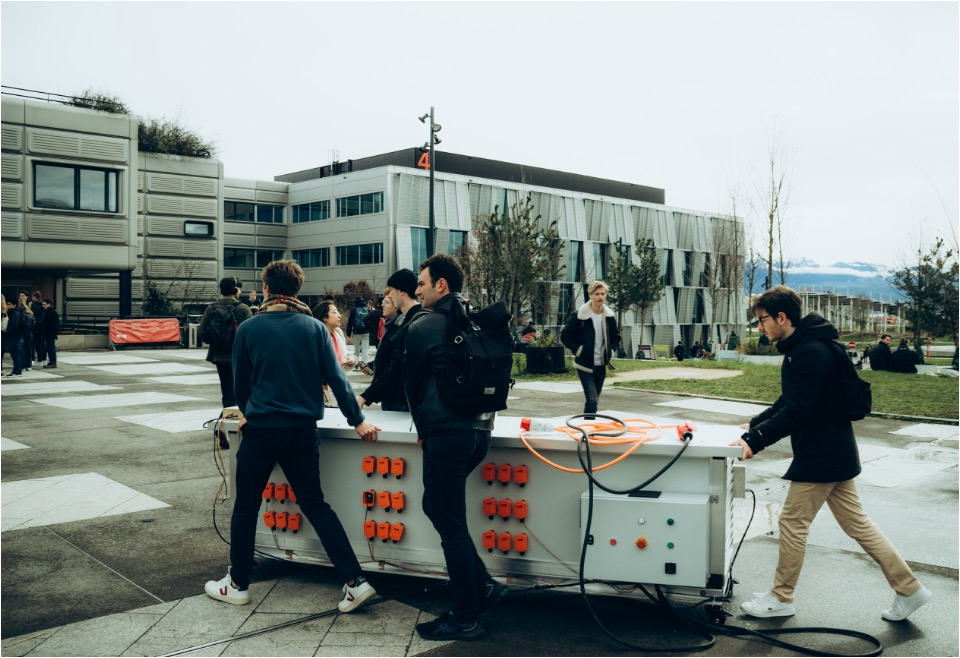

<h1 align="center">
AdsorpSim - The ultimate tool for carbon capture !
</h1>

<br>

A package to model the adsorption of atmospheric CO₂.

Developed for the **EPFL Carbon Team**, this tool is designed to generate **breakthrough curves** for **direct air capture (DAC)** of CO₂. It plays a critical role in tuning carbon capture machines and identifying the **optimal adsorption time**, accelerating the journey toward efficient climate solutions. It's an open source alternative to expensive softwares!


---

## 📚 Table of Contents

- [🔥 Usage](#-usage)  
- [👩‍💻 Installation](#-installation)  
- [🛠️ Development Installation](#️-development-installation)  
- [✅ Run Tests and Coverage](#run-tests-and-coverage)  

---

## 🔥 Usage
One of the key features of AdsorpSim is the ability to customize several key parameters, allowing you to model the adsorption process more precisely for your specific system. Here's a breakdown of what you can configure:

**1. Bed Parameters**
You can specify the characteristics of the adsorption bed, including bed dimensions

**2. Airflow**
The airflow through the adsorption bed is a critical parameter. You can define: Airflow rate (m³/s)

**3. Adsorbent Type**
Choose from various types of adsorbents, such as:
- Activated carbon
- Zeolites
- Amine-based adsorbents
- Metal-organic frameworks (MOFs)

Or create you custom adsorbant!

**4. Humidity Control**
You can also precisely control humidity levels in the incoming air. This is crucial because humidity can significantly impact the adsorption process, especially in systems that capture both CO₂ and water.

**5. Dual Adsorption Modeling for CO₂ and H₂O**
AdsorpSim supports dual adsorption of both CO₂ and water vapor. This feature models how water and CO₂ adsorb simultaneously on the same surface, which is critical for accurate simulation in real-world applications.

**6. User Interface (UI)**
For ease of use, AdsorpSim provides a user interface to interact with the simulation parameters. The interface allows you to input parameters interactively and view results in real-time.

You'll quickly get access to: 

- Graphs: Visualize adsorption breakthrough curves for both CO₂ and H₂O.
- Adsorbed Amounts: See the total amount of CO₂ and H₂O adsorbed in the system over time.

**7. Optimal Adsorption Time Calculation**
The tool will calculate the optimal time to reach a specific CO₂ capture percentage. You can set your desired capture percentage, and the model will determine the best adsorption time to reach that level of efficiency.

This feature is essential for optimizing direct air capture  systems, ensuring maximum efficiency in capturing CO₂ while minimizing energy usage.

## 👩‍💻 Installation

Create a new environment, you may also give the environment a different name. 

```
conda create -n adsorpsim python=3.10 
```

```
conda activate adsorpsim
(conda_env) $ pip install .
```

If you need jupyter lab, install it 

```
(adsorpsim) $ pip install jupyterlab
```

You should also install the following dependencies if they are not already installed:
```
(adsorpsim) $ pip install numpy matplotlib streamlit panda scipy 
```


## 🛠️ Development installation

Initialize Git (only for the first time). 

Note: You should have create an empty repository on `https://github.com:Julian-Barth/AdsorpSim`.

```
git init
git add * 
git add .*
git commit -m "Initial commit" 
git branch -M main
git remote add origin git@github.com:Julian-Barth/AdsorpSim.git 
git push -u origin main
```

Then add and commit changes as usual. 

To install the package, run

```
(adsorpsim) $ pip install -e ".[test,doc]"
```


### ✅ Run tests and coverage

```
(conda_env) $ pip install tox
(conda_env) $ tox
```


